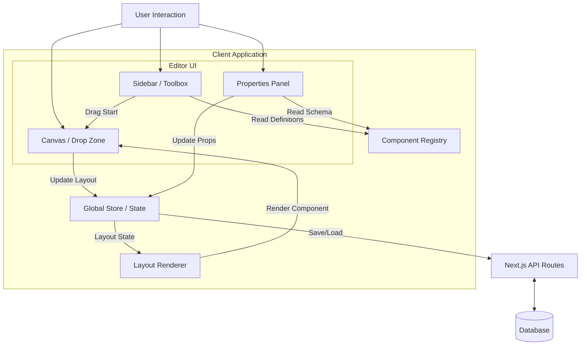
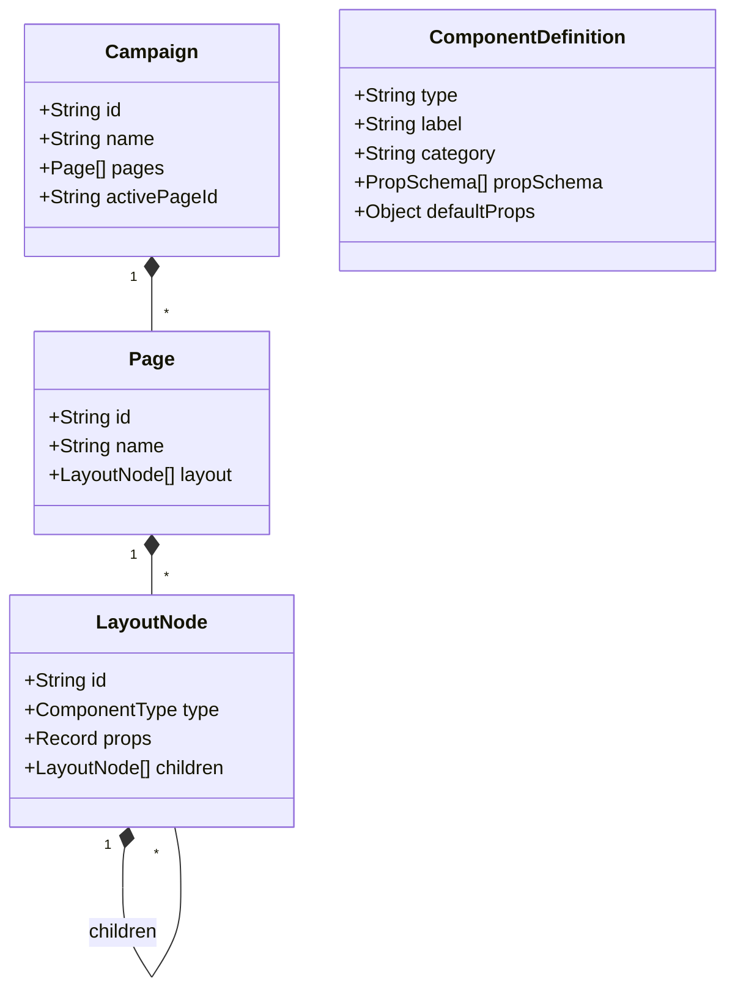
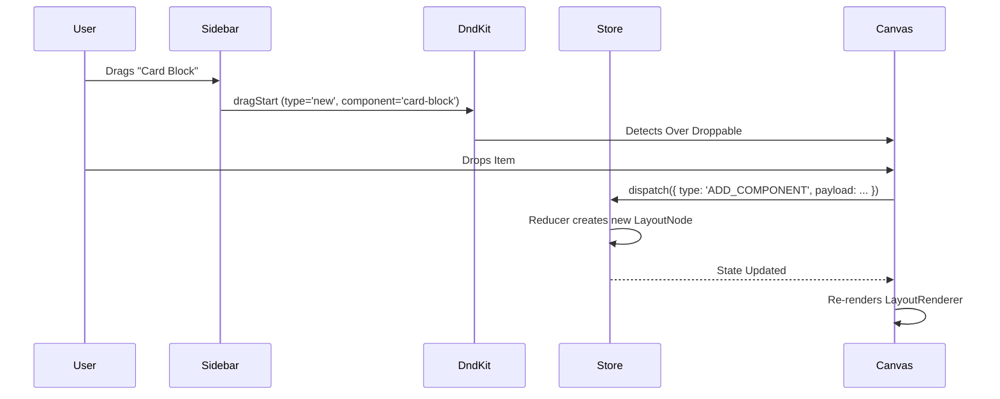

# DND CMS / Page Builder

A modern, comprehensive drag-and-drop page builder built with Next.js, Typescript, and Tailwind CSS. This system allows users to visually construct web pages using a set of registered components, configure their properties in real-time, and export/publish the result.

## 🏗️ System Architecture

The project follows a **Registry-Driven Architecture**. Instead of hardcoding component logic into the editor, the system uses a central "Registry" to define available blocks, their schemas, and their behavior. This makes the system highly extensible—adding a new component is as simple as adding an entry to the registry.

### High-Level Architecture



## 🧩 Core Concepts

### 1. The Registry Pattern
Located in `@/lib/registry`, the registry serves as the single source of truth for all components (Building Blocks & Content).

*   **Definition**: Defines metadata (label, icon), default props, and configuration schema.
*   **Decoupling**: The Editor doesn't know what a "Button" is; it just reads the registry to know it has a `text` prop of type `string` and renders a text input for it.

### 2. JSON-Based Layout
The entire page structure is serializable to JSON. A page is simply a tree of `LayoutNode` objects.

```typescript
interface LayoutNode {
  id: string;
  type: ComponentType; // e.g., 'card-block', 'text'
  props: Record<string, any>; // e.g., { text: "Hello", color: "#f00" }
  children?: LayoutNode[]; // Recursive children for container blocks
}
```

### 3. Recursive Rendering
The `LayoutRenderer` component takes the JSON tree and recursively renders it. It uses the `type` field of each node to look up the actual React component implementation (e.g., `CardBlock.tsx`) and passes the `props` to it.

## 📐 Data Models



## 🔄 Data Flow: Drag & Drop

When a user drags a component from the sidebar to the canvas, the following flow occurs:



## 📂 Project Structure

```bash
├── app/                    # Next.js App Router pages
│   ├── api/                # Backend API routes
│   ├── preview/            # Public preview page
│   └── page.tsx            # Main Editor page
├── components/
│   ├── building-blocks/    # Container components (Grid, Flex, Card)
│   ├── content/            # Leaf components (Text, Image, Button, etc.)
│   ├── editor/             # Editor UI (Properties Panel, Canvas, Sidebar)
│   └── renderer/           # LayoutRenderer logic
├── lib/
│   ├── registry/           # Component definitions and schemas
│   │   ├── building-blocks.ts
│   │   ├── content.ts
│   │   └── index.ts
│   ├── store.tsx           # React Context + Reducer state management
│   └── types.ts            # TypeScript interfaces
└── public/                 # Static assets
```

## 🚀 Getting Started

1.  **Install Dependencies**
    ```bash
    npm install
    ```

2.  **Run Development Server**
    ```bash
    npm run dev
    ```

3.  **Open Editor**
    Navigate to `http://localhost:3000` to start building pages.

## 🛠️ Adding a New Component

1.  **Create Component**: Add the React component file in `components/content/`.
2.  **Update Types**: Add the new type string to `ComponentType` in `lib/types.ts`.
3.  **Register**: Add the definition to `lib/registry/content.ts` (or `building-blocks.ts`).
    *   Define the `propSchema` to automatically generate the settings UI.
4.  **Render**: mapping in `components/renderer/LayoutRenderer.tsx`.
